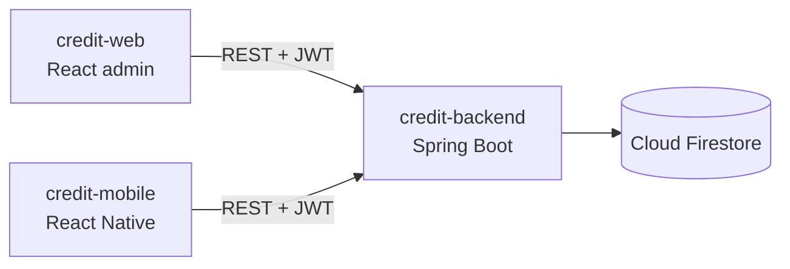
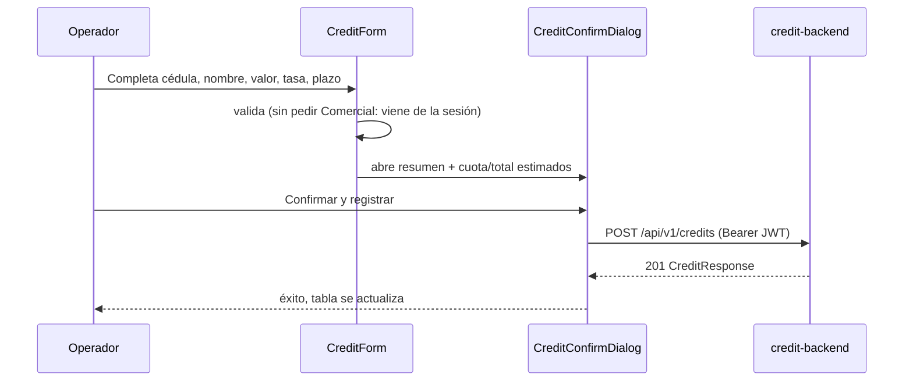
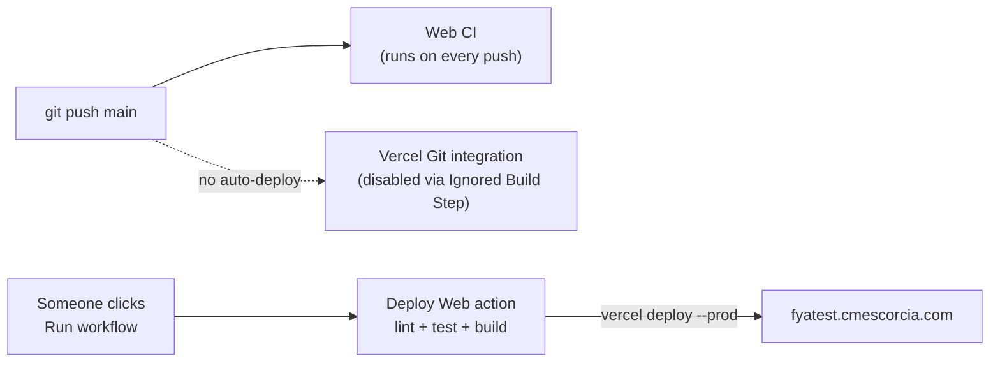

# Credit Web

React admin panel for the Fya Social Capital credit technical test — operators register/consult credits and monitor email notifications.

## Sobre esta prueba técnica

Este repo es **uno de los tres entregables independientes** de la prueba técnica de créditos:

| Repo | Rol | README |
|---|---|---|
| `credit-backend` | API REST, Firestore, JWT, worker de correo | [`../credit-backend/README.md`](../credit-backend/README.md) |
| `credit-web` (este repo) | Panel administrativo (React) para registrar/consultar créditos y monitorear correos | — |
| `credit-mobile` | App Android (React Native) para el comercial en campo | [`../credit-mobile/README.md`](../credit-mobile/README.md) |

## Architecture



`credit-web` never talks to Firestore directly — everything goes through `credit-backend`. `credit-mobile` is the field-operative counterpart to this admin panel.

### Registrar crédito (con confirmación)



## Capturas

| Login | Consulta de créditos |
|---|---|
|  |  |

| Registrar crédito | Confirmación con cuota estimada |
|---|---|
|  |  |

| Correos de crédito |
|---|
|  |

## Stack

| Layer | Tech |
|---|---|
| UI | React 18.3.1, MUI |
| Build | Vite |
| Routing | React Router |
| Language | JavaScript only (no TypeScript, no build step for types) |

## Requisitos Previos

| Herramienta | Versión | Notas |
|---|---|---|
| Node.js | 20+ | Ver `credit-mobile/package.json` `engines` como referencia; sin `engines` propio en este repo |
| npm | 10+ | Incluido con Node |
| `credit-backend` corriendo | — | Esta app no funciona standalone; necesita la API en `VITE_API_BASE_URL` |

## Instalación Paso A Paso

1. **Asegurate de tener `credit-backend` corriendo** (ver su README) — sin la API arriba, el login y todas las vistas fallan.
2. **Instalá dependencias:**
   ```bash
   cd credit-web
   npm install
   ```
3. **Configurá el entorno:**
   ```bash
   cp .env.example .env
   ```
   Por defecto `VITE_API_BASE_URL=http://localhost:8080`, que coincide con el backend local.
4. **Levantá el dev server:**
   ```bash
   npm run dev
   ```
   Abre en `http://localhost:5173`.
5. **Iniciá sesión** con un usuario sembrado del backend (`900100001 / demo12345`) o el usuario demo (`demo / demo12345`).
6. **Explorá**: `/credits` para registrar/consultar créditos, `/email-jobs` para ver el estado de las notificaciones.

## Pages

| Route | Purpose | Doc |
|---|---|---|
| `/login` | Public sign-in | [`pages/login/README.md`](pages/login/README.md) |
| `/credits` | Register credits (with a confirmation + estimated-payment step) and consult active ones | [`pages/credits/README.md`](pages/credits/README.md) |
| `/email-jobs` | Monitor notification delivery status, see failures inline | [`pages/email-jobs/README.md`](pages/email-jobs/README.md) |

## Test & Build

```bash
npm run lint
npm test
npm run build
```

## Documentation Map

| File | Covers |
|---|---|
| [`AGENTS.md`](AGENTS.md) | Working rules for agents in this repo |
| [`document/overview.md`](document/overview.md) | SPA architecture |
| [`document/module-map.md`](document/module-map.md) | Canonical inventory of views/modules |
| [`document/api.md`](document/api.md) | REST contract consumed by web |
| [`document/security.md`](document/security.md) | JWT, storage, protected routes |
| [`document/testing.md`](document/testing.md) | Test commands and scenarios |
| [`document/deployment.md`](document/deployment.md) | Vercel and `VITE_API_BASE_URL` |
| [`document/agents/`](document/agents/) | Agent playbooks and commit conventions |

## Deployment

Production is Vercel, served at the custom domain `https://fyatest.cmescorcia.com` (not the default `*.vercel.app` URL). **Deploys are manual, not automatic on push.**



1. Every push to `main` runs `Web CI` (lint/test/build) automatically — this is just a check, it does not deploy.
2. To actually ship: GitHub → **Actions** → **Deploy Web** → **Run workflow** (branch `main`). It re-runs lint/test/build and, only if that passes, runs `vercel deploy --prod`.
3. Vercel's own automatic Git-triggered deploys are turned off (Vercel project → Settings → Git → "Ignored Build Step" configured to always skip). This workflow is the only thing that reaches production.

Required repo secrets (`gh secret set <NAME> --repo CarlosPolo019/credit-web`): `VERCEL_TOKEN`, `VERCEL_ORG_ID`, `VERCEL_PROJECT_ID`. Full details (including the DNS/domain setup and the SPA-rewrite `vercel.json`): [`document/deployment.md`](document/deployment.md).
