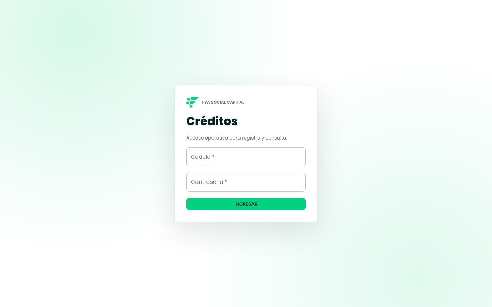
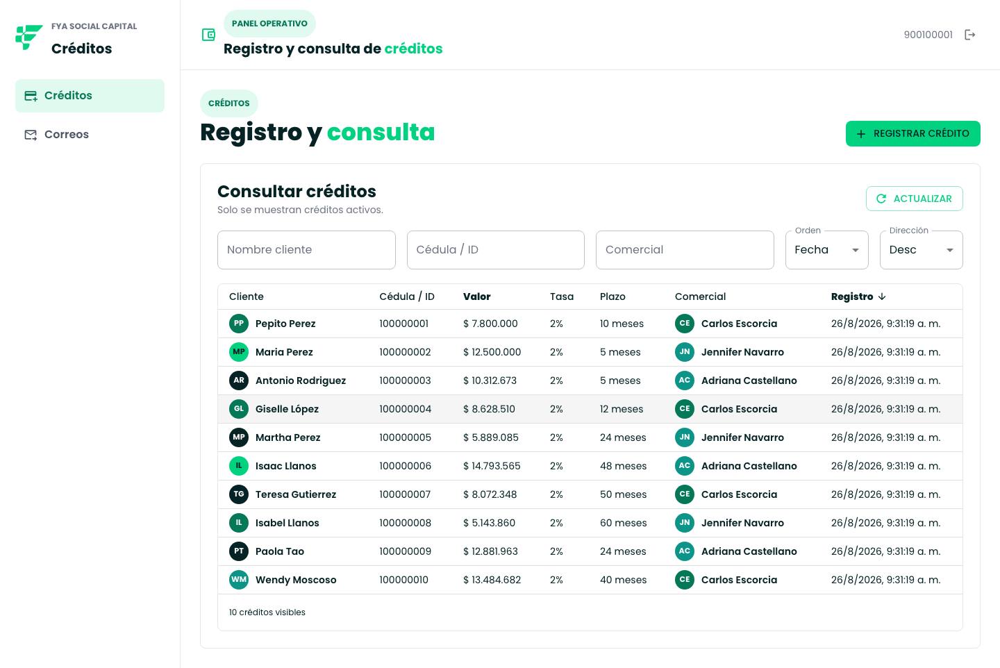
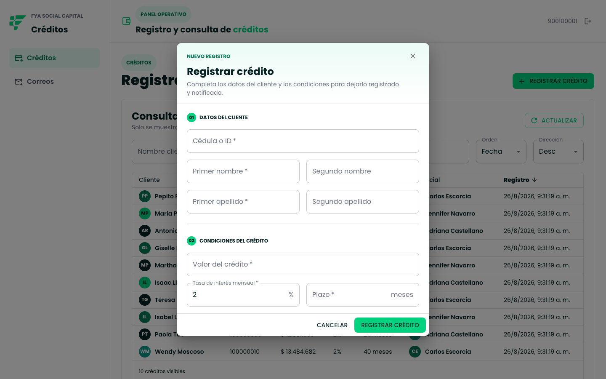
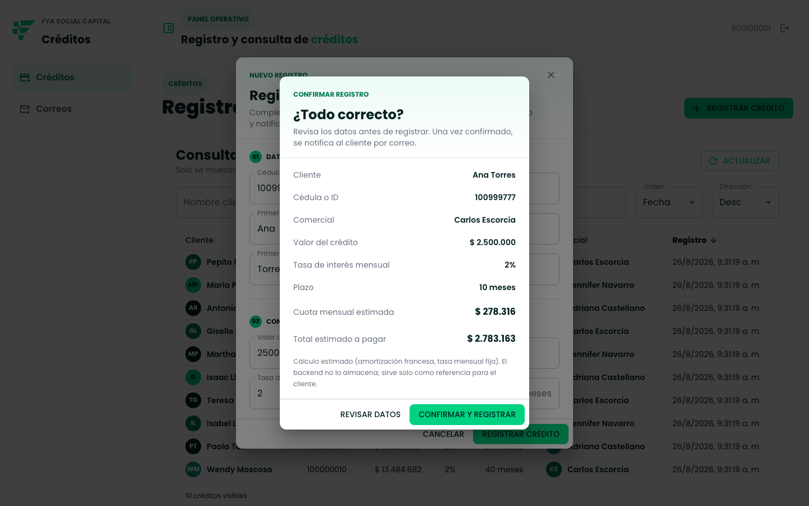
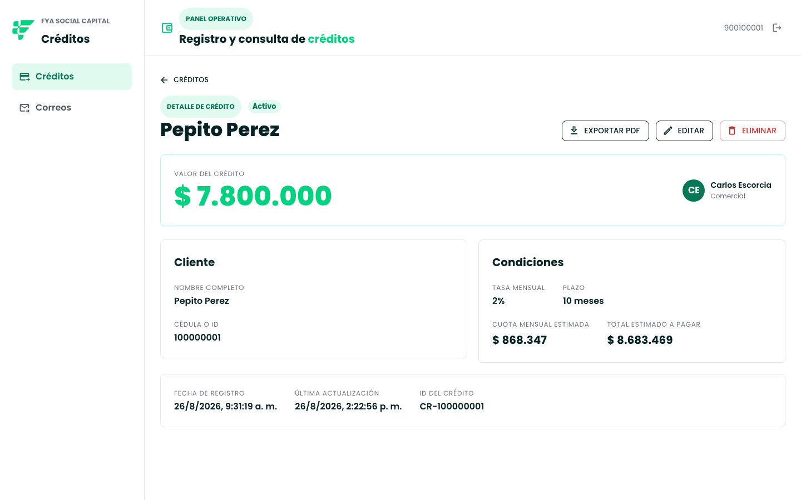
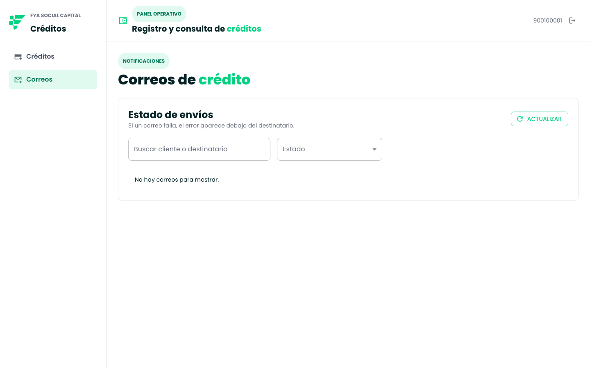
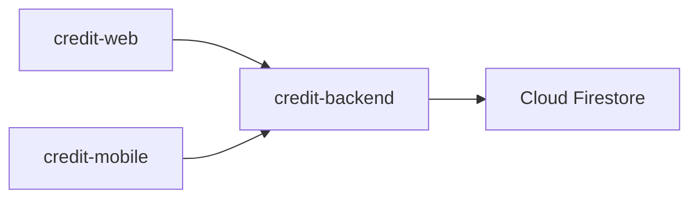
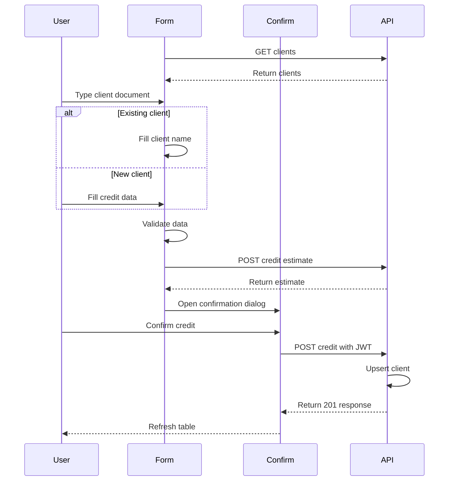
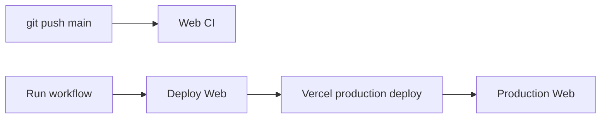

# Credit Web

Panel administrativo en React para la prueba técnica de créditos de Fya Social Capital — los operadores registran/consultan créditos y monitorean las notificaciones por correo.

## Índice
- [Demo En Vivo](#demo-en-vivo)
- [Sobre Esta Prueba Técnica](#sobre-esta-prueba-técnica)
- [Capturas](#capturas)
- [Arquitectura](#arquitectura)
- [Stack](#stack)
- [Instalación Local](#instalación-local)
- [Páginas](#páginas)
- [Roles Y Permisos](#roles-y-permisos)
- [Test Y Build](#test-y-build)
- [Deploy](#deploy)
- [Mapa De Documentación](#mapa-de-documentación)

## Demo En Vivo

No hace falta instalar nada para probar la app — frontend y backend ya están desplegados:

- **Web**: **[https://fyatest.cmescorcia.com](https://fyatest.cmescorcia.com)**
- **API**: `https://fyatest-api.cmescorcia.com`

Credenciales de prueba:

| Cédula | Contraseña | Nombre |
|---|---|---|
| `900100001` | `demo12345` | Carlos Escorcia — único con rol `ADMIN` (ve Dashboard, Correos, Clientes y Usuarios) |
| `900100002` | `demo12345` | Jennifer Navarro |
| `900100003` | `demo12345` | Adriana Castellano |

Con cualquiera de esos usuarios podés registrar un crédito (la cédula tiene autocomplete: si ya existe, el nombre se completa solo) con confirmación y cuota estimada, consultar/filtrar/editar/eliminar la tabla de créditos (paginada, 10 por página en escritorio y 5 en mobile), y entrar al detalle de uno (`/credits/:id`) para exportarlo a PDF. Con la cuenta de Carlos Escorcia además se ve `/dashboard` (estadísticas agregadas), `/email-jobs` (estado de notificaciones), `/clients` (directorio de clientes) y `/users` (crear cuentas de prueba) — el resto de las cuentas no las ve. Para correrlo en tu máquina en vez de usar la demo: [Instalación Local](#instalación-local).

> **¿La API tarda en responder la primera vez?** El backend corre en el plan gratuito de Render y puede entrar en reposo por inactividad. La web lo detecta sola y muestra una pantalla de "despertando el servidor" (con el logo animado) mientras reintenta — no hace falta refrescar.

## Sobre Esta Prueba Técnica

Este repo es uno de los tres entregables independientes de la prueba técnica de créditos:

| Repo | Rol | README |
|---|---|---|
| `credit-backend` | API REST, Firestore, JWT, worker de correo | [github.com/CarlosPolo019/credit-backend](https://github.com/CarlosPolo019/credit-backend) |
| `credit-web` (este repo) | Panel administrativo para registrar/consultar créditos y monitorear correos | — |
| `credit-mobile` | App Android para el comercial en campo | [github.com/CarlosPolo019/credit-mobile](https://github.com/CarlosPolo019/credit-mobile) |

## Capturas

| Login | Consulta de créditos |
|---|---|
|  |  |

| Registrar crédito | Confirmación con cuota estimada |
|---|---|
|  |  |

| Detalle de crédito | Correos de crédito |
|---|---|
|  |  |

## Arquitectura



`credit-web` nunca habla con Firestore directamente — todo pasa por `credit-backend`. `credit-mobile` es la contraparte para el comercial en campo de este panel administrativo.

### Registrar Crédito (Con Confirmación)



## Stack

| Capa | Tecnología |
|---|---|
| UI | React 18.3.1, MUI |
| Build | Vite |
| Ruteo | React Router |
| Gráficos | `recharts` (barras y donut en `/dashboard`) |
| PDF | Generado en `credit-backend` (`GET /credits/{id}/pdf`), mismo endpoint que usa `credit-mobile`; la web solo descarga el archivo |
| Lenguaje | Solo JavaScript (sin TypeScript, sin paso de compilación de tipos) |

## Instalación Local

Solo necesario si querés correr la app en tu máquina en vez de usar la [demo en vivo](#demo-en-vivo).

### Requisitos Previos

- Node.js 20+ y npm 10+.
- Una API disponible en `VITE_API_BASE_URL` — la local (`credit-backend`) o la de la demo (ver paso 3).

### Paso A Paso

1. **Instalá dependencias:**
   ```bash
   cd credit-web
   npm install
   ```
2. **Configurá el entorno:**
   ```bash
   cp .env.example .env
   ```
3. **Elegí contra qué backend correr:**
   - Contra tu propio backend local (ver [github.com/CarlosPolo019/credit-backend](https://github.com/CarlosPolo019/credit-backend)): dejá el valor por defecto, `VITE_API_BASE_URL=http://localhost:8080`.
   - Contra el backend de la demo ya desplegado (sin instalar nada más): poné `VITE_API_BASE_URL=https://fyatest-api.cmescorcia.com` en el `.env`.
4. **Levantá el dev server:**
   ```bash
   npm run dev
   ```
   Se abre en `http://localhost:5173`.
5. **Iniciá sesión** con un usuario sembrado (`900100001 / demo12345`, ver tabla arriba) o el usuario demo genérico (`demo / demo12345`).
6. **Explorá**: `/credits` para registrar/consultar créditos, `/email-jobs` para ver el estado de las notificaciones.

## Páginas

| Ruta | Qué hace | Doc |
|---|---|---|
| `/login` | Ingreso público | [`pages/login/README.md`](pages/login/README.md) |
| `/credits` | Registrar créditos (con confirmación + cuota estimada) y consultar los activos, paginados | [`pages/credits/README.md`](pages/credits/README.md) |
| `/credits/:id` | Detalle de un crédito: editar, eliminar y exportar a PDF | [`pages/credits/README.md`](pages/credits/README.md) |
| `/dashboard` | Estadísticas agregadas: créditos por comercial, monto total solicitado, ganancia total estimada, correos por estado — **solo `role: "ADMIN"`** | [`pages/dashboard/README.md`](pages/dashboard/README.md) |
| `/email-jobs` | Ver el estado de entrega de notificaciones, errores visibles al toque — **solo `role: "ADMIN"`** | [`pages/email-jobs/README.md`](pages/email-jobs/README.md) |
| `/clients` | Directorio de solo lectura (cédula + nombre) — **solo `role: "ADMIN"`** | [`pages/clients/README.md`](pages/clients/README.md) |
| `/users` | Crear cuentas `USER` de prueba (comerciales) — **solo `role: "ADMIN"`** | [`pages/users/README.md`](pages/users/README.md) |

## Roles Y Permisos

Cada usuario tiene un `role` (`ADMIN` o `USER`) que viaja en el JWT desde `credit-backend`. Hoy solo distingue quién ve Dashboard, Correos, Clientes y Usuarios — **crear/editar/eliminar créditos es igual para todas las cuentas**, el rol no toca eso.

| Rol | Cuenta(s) | Qué ve de más |
|---|---|---|
| `ADMIN` | `900100001` (Carlos Escorcia) — única cuenta seed con este rol | `/dashboard`, `/email-jobs`, `/clients` y `/users`, además de todo lo que ve `USER` |
| `USER` | Todas las demás (Jennifer, Adriana, cuentas creadas por un admin desde `/users`, usuario demo) | `/credits` y `/credits/:id` únicamente |

La restricción es real en el backend, no solo cosmética en la UI: `SecurityConfig` exige `ROLE_ADMIN` para `/api/v1/email-jobs/**` (un token `USER` recibe `403` aunque llame directo con `curl`), y `POST /api/v1/users` — un endpoint dedicado, admin-only, sin relación con auto-registro — es la única forma de crear una cuenta nueva o de que termine siendo `ADMIN` (no devuelve token de la cuenta creada, así que no pisa la sesión del admin). `AdminRoute` en `router.jsx` es solo la segunda línea de defensa: oculta el sidebar y redirige a `/credits` si alguien sin el rol entra por URL directa. Detalle de punta a punta: [`document/security.md`](document/security.md), [`pages/users/README.md`](pages/users/README.md).

## Test Y Build

```bash
npm run lint
npm test
npm run build
```

## Deploy

Producción corre en Vercel bajo el dominio propio `https://fyatest.cmescorcia.com`. El deploy es manual: `git push` solo dispara lint/test/build como validación, no despliega nada.



Para desplegar: GitHub → **Actions** → **Deploy Web** → **Run workflow**, o desde la terminal (requiere `gh` autenticado) con `npm run deploy` (`npm run deploy:status` para ver el resultado). Detalles (secrets, dominio/DNS, `vercel.json`): [`document/deployment.md`](document/deployment.md).

## Mapa De Documentación

| Archivo | Qué cubre |
|---|---|
| [`AGENTS.md`](AGENTS.md) | Reglas de trabajo para agentes en este repo |
| [`document/overview.md`](document/overview.md) | Arquitectura de la SPA |
| [`document/module-map.md`](document/module-map.md) | Inventario canónico de vistas/módulos |
| [`document/api.md`](document/api.md) | Contrato REST que consume la web |
| [`document/security.md`](document/security.md) | JWT, storage, rutas protegidas |
| [`document/testing.md`](document/testing.md) | Comandos y escenarios de prueba |
| [`document/deployment.md`](document/deployment.md) | Vercel, dominio propio y `VITE_API_BASE_URL` |
| [`document/agents/`](document/agents/) | Playbooks de agentes y convenciones de commit |
