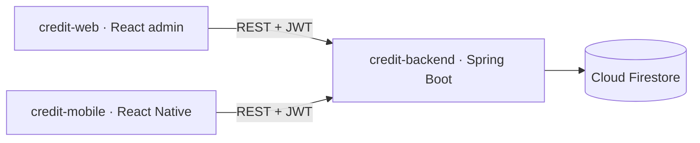
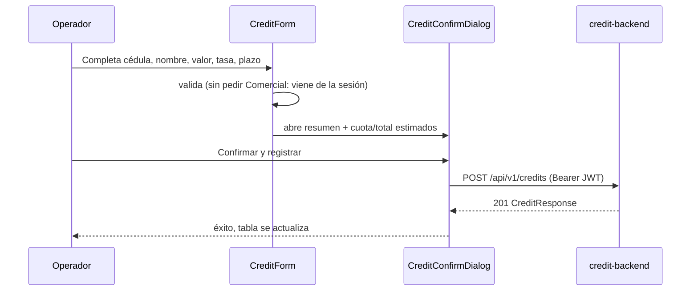
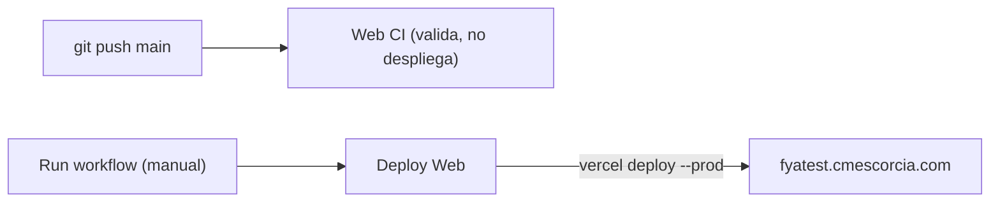

# Credit Web

Panel administrativo en React para la prueba técnica de créditos de Fya Social Capital — los operadores registran/consultan créditos y monitorean las notificaciones por correo.

## Demo En Vivo

No hace falta instalar nada para probar la app — frontend y backend ya están desplegados:

- **Web**: **[https://fyatest.cmescorcia.com](https://fyatest.cmescorcia.com)**
- **API**: `https://fyatest-api.cmescorcia.com`

Credenciales de prueba:

| Cédula | Contraseña | Nombre |
|---|---|---|
| `900100001` | `demo12345` | Carlos Escorcia |
| `900100002` | `demo12345` | Jennifer Navarro |
| `900100003` | `demo12345` | Adriana Castellano |

Con cualquiera de esos usuarios podés registrar un crédito (con confirmación y cuota estimada), consultar/filtrar/editar/eliminar la tabla de créditos, entrar al detalle de uno (`/credits/:id`) para exportarlo a PDF, y ver en `/email-jobs` el estado real de las notificaciones. Para correrlo en tu máquina en vez de usar la demo: [Instalación Local](#instalación-local).

## Sobre Esta Prueba Técnica

Este repo es uno de los tres entregables independientes de la prueba técnica de créditos:

| Repo | Rol | README |
|---|---|---|
| `credit-backend` | API REST, Firestore, JWT, worker de correo | [`../credit-backend/README.md`](../credit-backend/README.md) |
| `credit-web` (este repo) | Panel administrativo para registrar/consultar créditos y monitorear correos | — |
| `credit-mobile` | App Android para el comercial en campo | [`../credit-mobile/README.md`](../credit-mobile/README.md) |

## Arquitectura



`credit-web` nunca habla con Firestore directamente — todo pasa por `credit-backend`. `credit-mobile` es la contraparte para el comercial en campo de este panel administrativo.

### Registrar Crédito (Con Confirmación)



## Capturas

| Login | Consulta de créditos |
|---|---|
|  |  |

| Registrar crédito | Confirmación con cuota estimada |
|---|---|
|  |  |

| Detalle de crédito | Correos de crédito |
|---|---|
|  |  |

## Stack

| Capa | Tecnología |
|---|---|
| UI | React 18.3.1, MUI |
| Build | Vite |
| Ruteo | React Router |
| PDF | Generado en `credit-backend` (`GET /credits/{id}/pdf`), mismo endpoint que usa `credit-mobile`; la web solo descarga el archivo |
| Lenguaje | Solo JavaScript (sin TypeScript, sin paso de compilación de tipos) |

## Instalación Local

Solo necesario si querés correr la app en tu máquina en vez de usar la [demo en vivo](#demo-en-vivo).

### Requisitos Previos

- Node.js 20+ y npm 10+.
- Una API disponible en `VITE_API_BASE_URL` — la local (`credit-backend`) o la de la demo (ver paso 3).

### Paso A Paso

1. **Instalá dependencias:**
   ```bash
   cd credit-web
   npm install
   ```
2. **Configurá el entorno:**
   ```bash
   cp .env.example .env
   ```
3. **Elegí contra qué backend correr:**
   - Contra tu propio backend local (ver [`../credit-backend/README.md`](../credit-backend/README.md)): dejá el valor por defecto, `VITE_API_BASE_URL=http://localhost:8080`.
   - Contra el backend de la demo ya desplegado (sin instalar nada más): poné `VITE_API_BASE_URL=https://fyatest-api.cmescorcia.com` en el `.env`.
4. **Levantá el dev server:**
   ```bash
   npm run dev
   ```
   Se abre en `http://localhost:5173`.
5. **Iniciá sesión** con un usuario sembrado (`900100001 / demo12345`, ver tabla arriba) o el usuario demo genérico (`demo / demo12345`).
6. **Explorá**: `/credits` para registrar/consultar créditos, `/email-jobs` para ver el estado de las notificaciones.

## Páginas

| Ruta | Qué hace | Doc |
|---|---|---|
| `/login` | Ingreso público | [`pages/login/README.md`](pages/login/README.md) |
| `/credits` | Registrar créditos (con confirmación + cuota estimada) y consultar los activos | [`pages/credits/README.md`](pages/credits/README.md) |
| `/credits/:id` | Detalle de un crédito: editar, eliminar y exportar a PDF | [`pages/credits/README.md`](pages/credits/README.md) |
| `/email-jobs` | Ver el estado de entrega de notificaciones, errores visibles al toque | [`pages/email-jobs/README.md`](pages/email-jobs/README.md) |

## Test Y Build

```bash
npm run lint
npm test
npm run build
```

## Mapa De Documentación

| Archivo | Qué cubre |
|---|---|
| [`AGENTS.md`](AGENTS.md) | Reglas de trabajo para agentes en este repo |
| [`document/overview.md`](document/overview.md) | Arquitectura de la SPA |
| [`document/module-map.md`](document/module-map.md) | Inventario canónico de vistas/módulos |
| [`document/api.md`](document/api.md) | Contrato REST que consume la web |
| [`document/security.md`](document/security.md) | JWT, storage, rutas protegidas |
| [`document/testing.md`](document/testing.md) | Comandos y escenarios de prueba |
| [`document/deployment.md`](document/deployment.md) | Vercel, dominio propio y `VITE_API_BASE_URL` |
| [`document/agents/`](document/agents/) | Playbooks de agentes y convenciones de commit |

## Deploy

Producción corre en Vercel bajo el dominio propio `https://fyatest.cmescorcia.com`. El deploy es manual: `git push` solo dispara lint/test/build como validación, no despliega nada.



Para desplegar: GitHub → **Actions** → **Deploy Web** → **Run workflow**, o desde la terminal (requiere `gh` autenticado) con `npm run deploy` (`npm run deploy:status` para ver el resultado). Detalles (secrets, dominio/DNS, `vercel.json`): [`document/deployment.md`](document/deployment.md).
