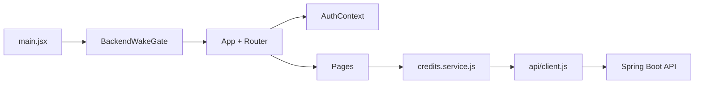

# Overview

`credit-web` es una SPA administrativa para la prueba tecnica de creditos.

## Arquitectura

`BackendWakeGate` (`app/BackendWakeGate.jsx`) bloquea el render de `App` hasta que `GET /actuator/health` responde, o hasta 75s (lo que pase primero) — cubre el cold start del plan gratuito de Render sin que cada pantalla tenga que manejar su propio error de conexion confuso.

## Carpetas
- `app/`: router, layouts, guardas y `BackendWakeGate` (gate de cold start del backend).
- `auth/`: contexto de sesion y storage.
- `api/`: cliente REST base.
- `lib/`: validaciones y formateo.
- `ui/`: componentes reutilizables.
- `pages/login/`: vista publica de ingreso.
- `pages/credits/`: vista protegida de registro y consulta.
- `pages/email-jobs/`: estado de notificaciones por correo, protegido + solo `role: "ADMIN"`.
- `pages/clients/`: directorio de solo lectura, protegido + solo `role: "ADMIN"`.
- `pages/users/`: crear cuentas `USER`/`ADMIN` de prueba, protegido + solo `role: "ADMIN"`.
- `pages/dashboard/`: estadisticas agregadas (creditos por comercial, montos, correos por estado), protegido + solo `role: "ADMIN"`.

## Invariantes
- No hay acceso directo a Firestore.
- La autenticacion depende del backend.
- El token se guarda en `localStorage` y se elimina al recibir `401`.
- La app es JavaScript-only.

## Interaccion
- Transiciones de ruta con `Fade` (`DashboardLayout.jsx`, key por `location.pathname`).
- Filas de tabla con aparicion escalonada vía CSS (`ui/DataTable.jsx` fija `--row-delay` por fila, `index.css` aplica la animacion) y fade-out al eliminar una fila.
- Banners de error/exito colapsables con `Collapse` en vez de aparecer/desaparecer de golpe.
- El hero de valor del credito en el detalle usa `Grow` al montar.
- Todas las animaciones respetan `prefers-reduced-motion` (`index.css`).

