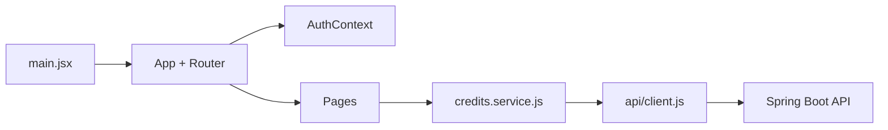

# Overview

`credit-web` es una SPA administrativa para la prueba tecnica de creditos.

## Arquitectura

## Carpetas
- `app/`: router, layouts y guardas.
- `auth/`: contexto de sesion y storage.
- `api/`: cliente REST base.
- `lib/`: validaciones y formateo.
- `ui/`: componentes reutilizables.
- `pages/login/`: vista publica de ingreso.
- `pages/credits/`: vista protegida de registro y consulta.

## Invariantes
- No hay acceso directo a Firestore.
- La autenticacion depende del backend.
- El token se guarda en `sessionStorage` y se elimina al recibir `401`.
- La app es JavaScript-only.

